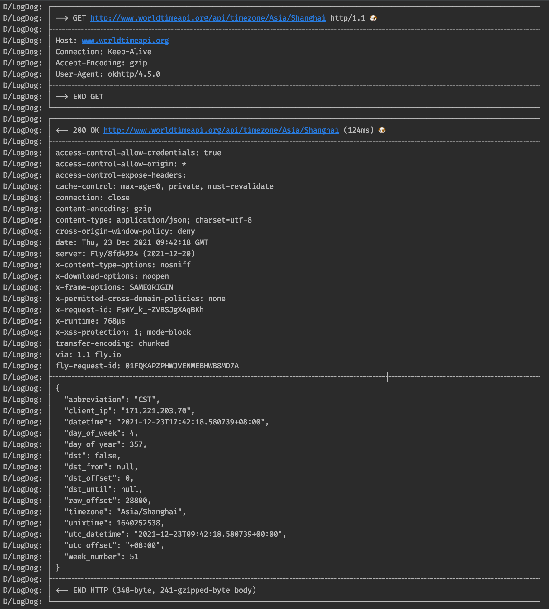

# LogDog [](https://jitpack.io/#michaellee123/LogDog)


 A Beautiful Log Printer For OkHttp.

It looks like this:



## Import

```gradle
repositories {
    maven { url 'https://jitpack.io' }
}
//something else...
implementation 'com.github.michaellee123:LogDog:[latest-version]' // find the latest-version in the JitPack badge, it's top of this document.
```

## Use

You just need call a funcation in your `OkHttpClient.Builder`, If you use retrofit, just need call once when init.

```kotlin
val okHttpClient: OkHttpClient = OkHttpClient.Builder()
    .logDog(tag = "LogDog",enable = BuildConfig.DEBUG)
    .build()
```

Or use more arguments:

```kotlin
val logDog = LogDog(
    tag = "LogDog", // for logcat print tag, if you use custom print, the tag will be useless
    enable = BuildConfig.DEBUG, // whether to enable print log
    print = { it ->
        Log.e(tag, it) // custom print, you can change the log level, or save the log to disk cache or more.
    },
    gson = GsonBuilder().setPrettyPrinting().serializeNulls().create() // log dog uses gson's pretty printing to format the output json string.
)
val logInterceptor = HttpLoggingInterceptor(logDog) // log dog based from HttpLoggingInterceptor.Logger
logInterceptor.level = HttpLoggingInterceptor.Level.BODY // you can change http log level, see HttpLoggingInterceptor.Level's document.
val okHttpClient = OkHttpClient.Builder().addNetworkInterceptor(logInterceptor).build() // add HttpLoggingInterceptor into OkHttpClient.Builder.
```

Now all your requests useing OkHttpClient will print a beautiful log.

## More Infomations

1. Font Family: [FiraCode](https://github.com/tonsky/FiraCode), you can also use `JetBrains Mono`, but I think `FiraCode` looks better than `JetBrains Mono`.
2. Ligatures: open Android Studio's Preferences -> Editor -> Font, check `Enable font ligatures`.
3. Logcat setting: disable `Soft-Wrap` first, then click the gear icon to disable `Show package name`. Of course, if your screen is very wide, you can ignore this prompt.
